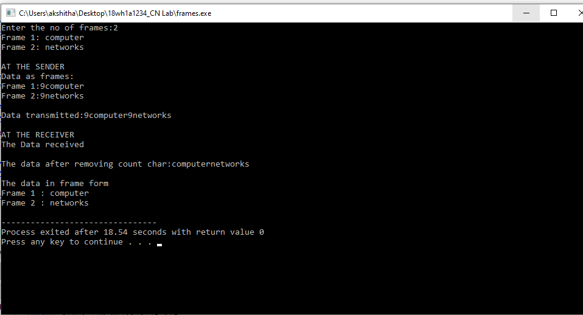
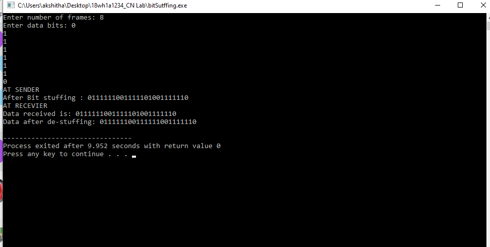
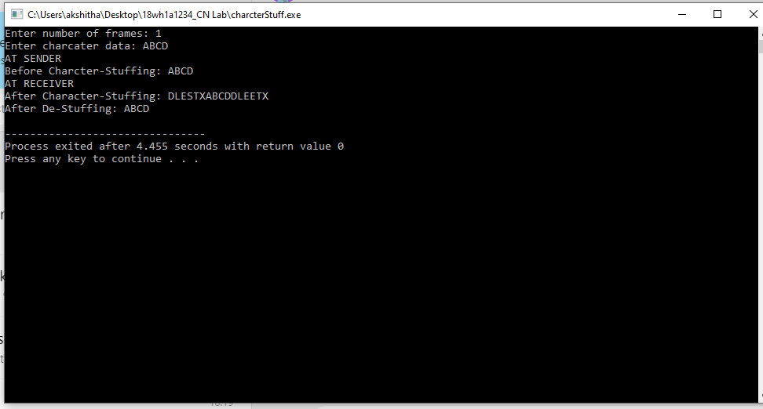

# Experiment 1

## Aim of the Experiment
To implement data link layer framing techniques such as
i.character count ii.character stuffing iii.bit stuffing

### step by step procedure of Experiment
#### For Charcter Count
1. Enter number of frames. 2. Print the data as frames. 3. Find the string length of each frame. 4.Print the data both at sender and receiver side.

#### For Bit Stuffing
1. Take the input as number of frames. 2. Enter Databits. 3. Apply Bitstuffing logic at sender side. 4. Destuff the databits at receiver side and print the output

#### For Character Stuffing
1. Take the input characters size based on the input size. 2. Enter character data. 3. Print the original data. 4. Apply character stuffing logic at sender side and print the data. 5. At receiver side destuff the stuffed data and print the output

### Output
#### Character Count

#### Bit Stuffing

#### Character Stuffing

