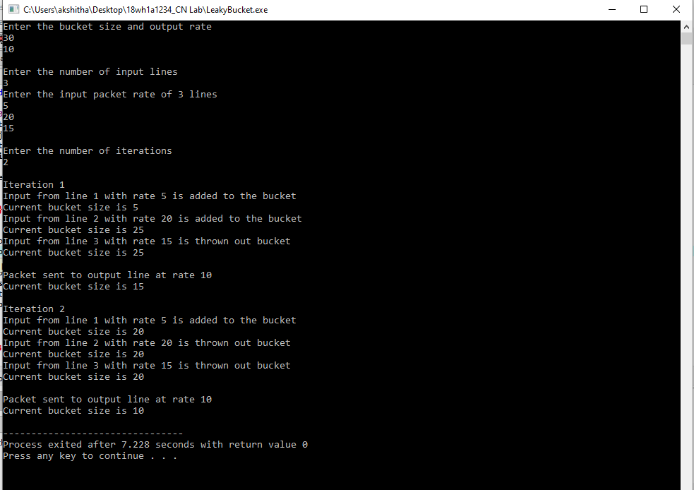

# Experiment 8

## Aim of the Experiment
To implement Congestion control using Leaky bucket algorithm

### step by step procedure of Experiment
Step 1: Start

Step 2: Set the bucket size or the buffer size.

Step 3: Set the output rate.

Step 4: Transmit the packets such that there is no overflow.

Step 5: Repeat the process of transmission until all packets are transmitted. (Reject packets where its size is greater than the bucket size)

Step 6: Stop

#### Leaky Bucket Algorithm

