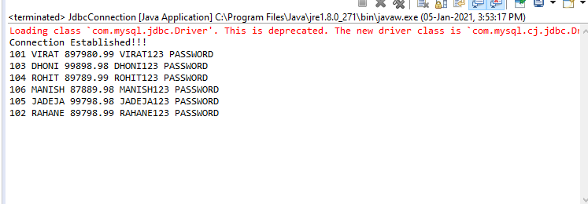

# Experiment JDBC Connection

## Aim of the Experiment
To JDBC with database(mysql)

### step by step procedure of Experiment
1. Load Driver
2. Create Connection
3. Create Statement
4. Exceute Query
5. Close Connectiom

### Output

