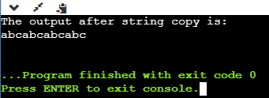
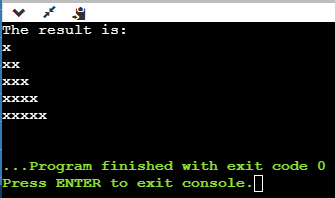

# Experiment 1

## Aim of the Experiment
Write a Ruby script to create a new string which is n copies of a given string where n is a nonnegative
integer

### Output
#### First Method

#### Second Method

